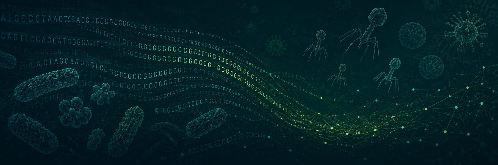

# Shari Larsen 
### Environmental Microbiologist | Bioinformatician | Ph.D Candidate

I investigate microbial communities using metagenomics, viromics, microbial genomics, and bioinformatics to better understand antimicrobial resistance, bacteriophages, and viral ecology in environmental systems.

---

## About Me

I am a Ph.D. candidate in the Quantitative and Systems Biology Graduate Program at the University of California, Merced.

My research combines microbiology, genomics, and computational biology to study microbial communities in wastewater and freshwater environments. I enjoy developing reproducible bioinformatics workflows that transform sequencing data into biological insights.

---

## Research Interests

- 🦠 Environmental Microbiology
- 🧬 Viromics
- 🧫 Bacteriophage Genomics
- 💊 Antimicrobial Resistance
- 🌎 Microbial Ecology
- 💻 Bioinformatics

---

## Featured Projects

### 🧬 Phage Genome Analysis
Genome assembly, annotation, and comparative analysis of a lytic bacteriophage isolated from wastewater.

### 💊 Antimicrobial Resistance Metagenomics
Metagenomic analysis of antibiotic resistance genes in anaerobic bioreactor communities exposed to amoxicillin.

### 🌊 Yosemite Lakes Viromics
Recovery and characterization of viral communities and auxiliary metabolic genes from alpine lake metagenomes.

---

## Bioinformatics Toolkit

**Languages**

- Bash
- R
- Python

**Sequence Processing**

- FastQC
- MultiQC
- fastp

**Assembly**

- metaSPAdes
- MEGAHIT

**Mapping**

- Bowtie2
- SAMtools

**Metagenomics**

- Kraken2
- Bracken

**Viromics**

- VirSorter2
- CheckV
- DRAM-v

**Antimicrobial Resistance**

- AMRFinderPlus
- CARD

---

## Current Focus

- Completing my Ph.D. dissertation
- Building reproducible bioinformatics workflows
- Preparing research for publication
- Expanding open scientific resources

---

## Connect

🌐 Portfolio Website: *sharilarsen.carrd.co*

💼 LinkedIn: *https://www.linkedin.com/in/sharilarsen/*

📧 Email: *slarsen5@ucmerced.edu*

---

*"Good science should be reproducible, transparent, and accessible."*

